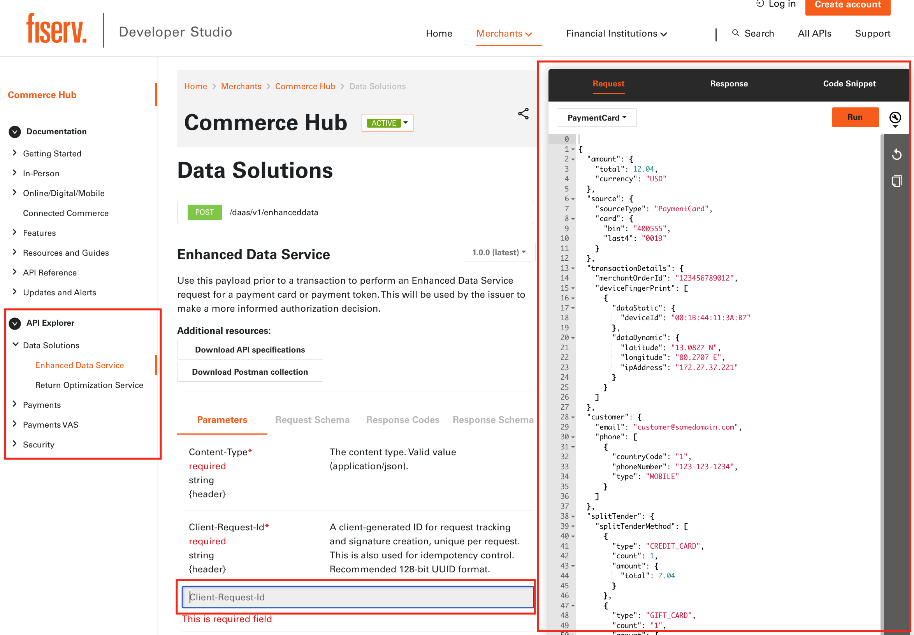
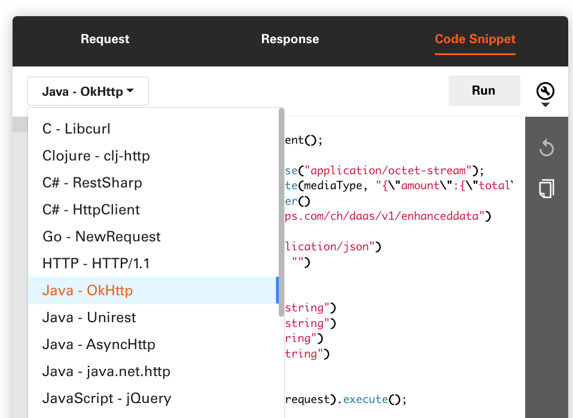
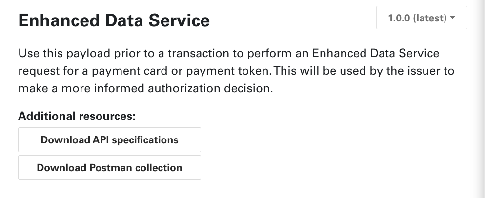
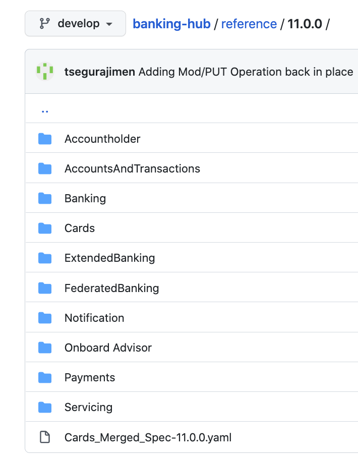
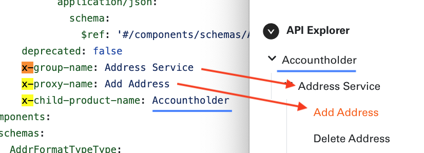
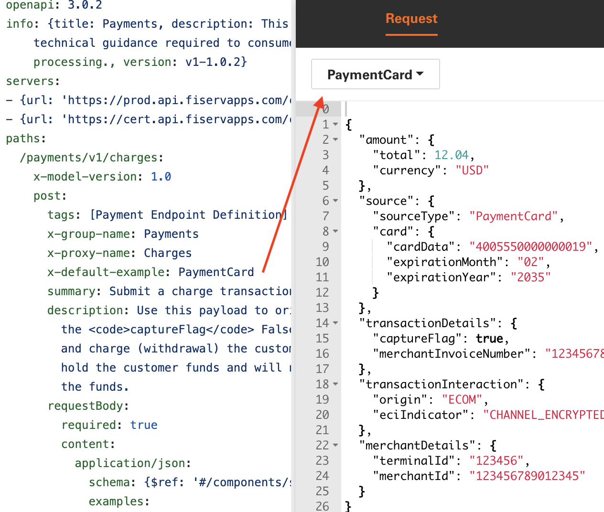

# API Explorer

On the API Explorer page a Developer can view endpoint URL, request, response schema, response codes.

https://user-images.githubusercontent.com/79716732/166037754-545cf73c-46e9-4e55-a1ce-5a8975d0055e.mp4

The RunBox on the right side of the pagee allows a Developer to veiw an end-point request and response payloads in convenient JSON format. 
It also supports experimentation by allowing a developer to edit request payload and visualize the results.

Another feature of the RunBox is the generation of code snippets in a variety of programming languages.

API Exploreer supports the ability to download API specification in openapi 3.0 format and Postman collection.

## OpenAPI Specification

> Developr Studio supports OpenAPI Specification Version 3.0 and above

The OpenAPI Specification (OAS) defines a standard, language-agnostic interface to RESTful APIs which allows both humans and computers to discover and understand the capabilities of the service without access to source code, documentation, or through network traffic inspection. When properly defined, a consumer can understand and interact with the remote service with a minimal amount of implementation logic. 
Refere to [Swagger](https://swagger.io/specification/) for more information on OpenAPI Specification.

OpenAPI Document (or set of documents) defines or describes an API. An OpenAPI definition uses and conforms to the OpenAPI Specification.

       "apiVersions": [
          {
            "version": "11.0.0",
            "versionType": "major",
            "releaseNotesPath": "/release-notes/release-notes-11.0.0.md",
            "apiSpecFileNames": [        
              "Accountholder/AddrAdd",
              "Accountholder/AddrDel",
              ...
            ]
          }
        ],

### OpenAPI Document Structure

It is required that OpenAPI document follows [JSON Schema](https://json-schema.org/)

An OpenAPI document MAY be made up of a single document or be divided into multiple, connected parts at the discretion of the user.
Sample of 

       openapi: 3.0.0
       info:
         title: Address Service - Add
         description: The Address service manages addresses related to parties and product accounts.
         version: 11.0.0
       servers:
       - url: /
       paths:
         /address:
           post:
              tags:
              - Add Address
              summary: Add Address
              description: ""
              operationId: addAddress
              parameters:
              requestBody:
              responses:
                "201":
              deprecated: false
              x-group-name: Address Service
              x-proxy-name: Add Address
              x-child-product-name: Accountholder
             

Last three fields are used to group API end-points into meaningfull features, where

              x-proxy-name: API end-point name
              x-group-name: API end-point group
              x-child-product-name: parent group of API end-point group
              

[Enable Sandbox](./enable-sandbox.md)

### Default Example

Enhance experience for tenants so they can set default example that can be viewed in run box by default.

