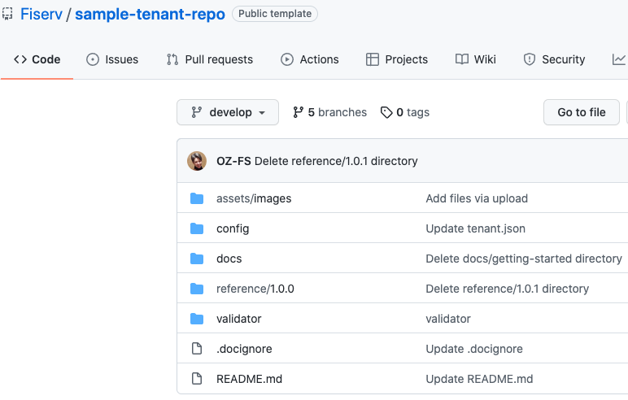
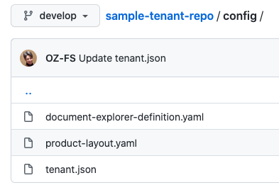
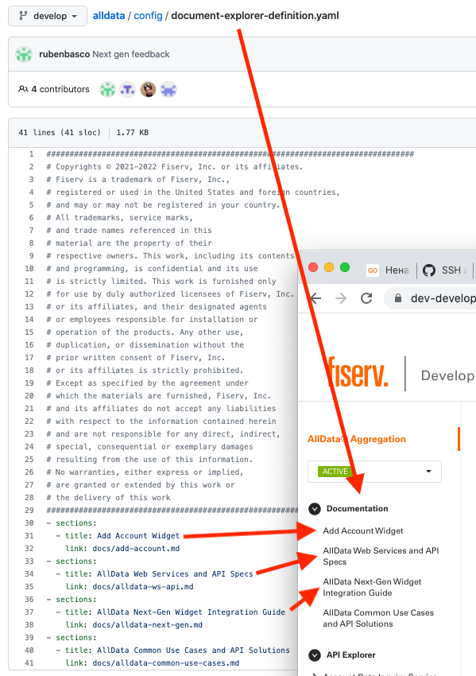
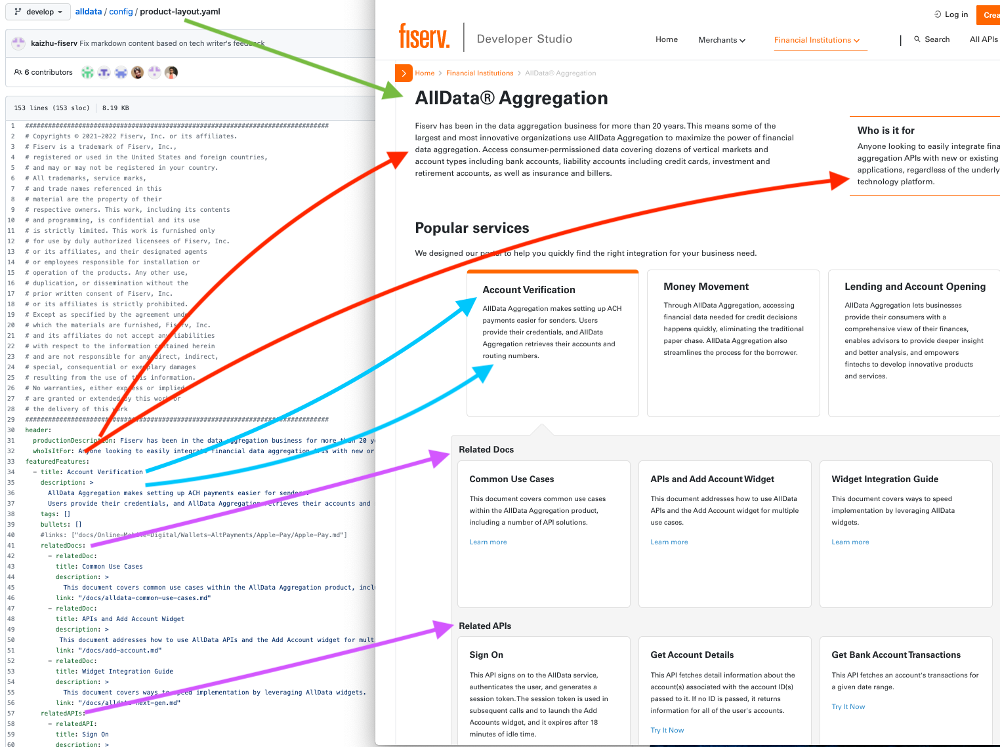
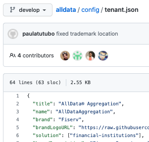
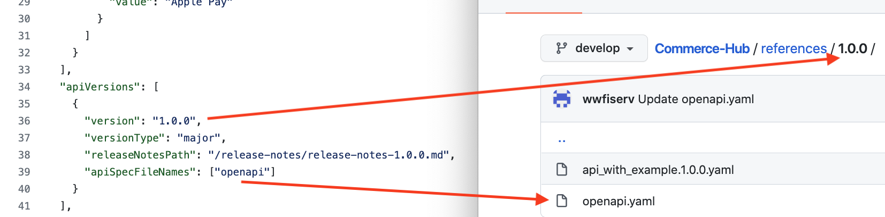

# How to use your space and modify your content.

### Required repository structure:

### Git branches
There are **three branches** that are required:
  - develop corresponds to [develop/qa environments](https://dev-developerstudio.fiserv.com)
  - stage corresponds to [stage environment](https://stage-developerstudio.fiserv.com)
  - main corresponds to [production environments](https://developer.fiserv.com)

### Configurations files 
Files under **config** directory define tenant/product setup, documentation tree, product page data.

**config/document-explorer-definition.yaml** defines documetation tree on left navigation panel

**config/product-layout.yaml** defines product page content

**config/tenant.yaml** defines product configuration such as 
  - name, 
  - industry or solution. Tenant is able to belong to multiple solutions.
  - API version, 
  - featured branches, 
  - sandbox features, 
  - support contact for tenant specific issues.

