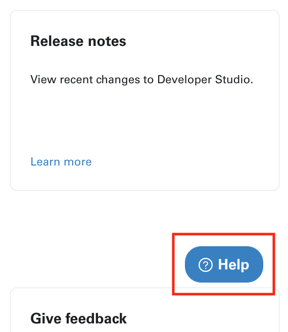
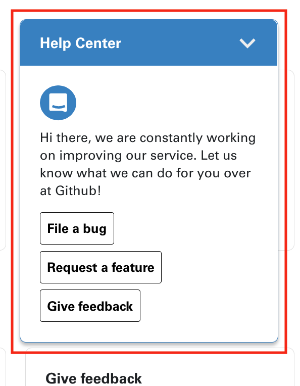
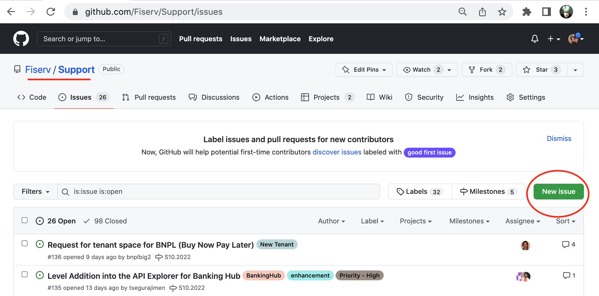
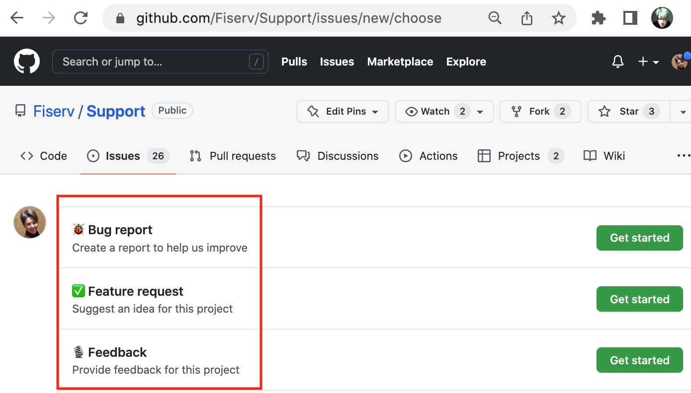
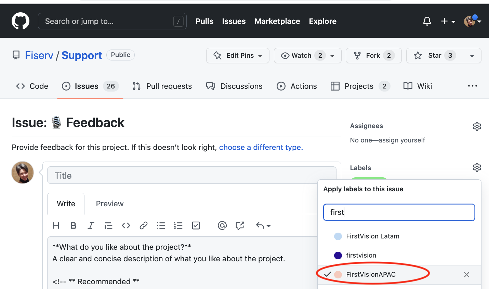
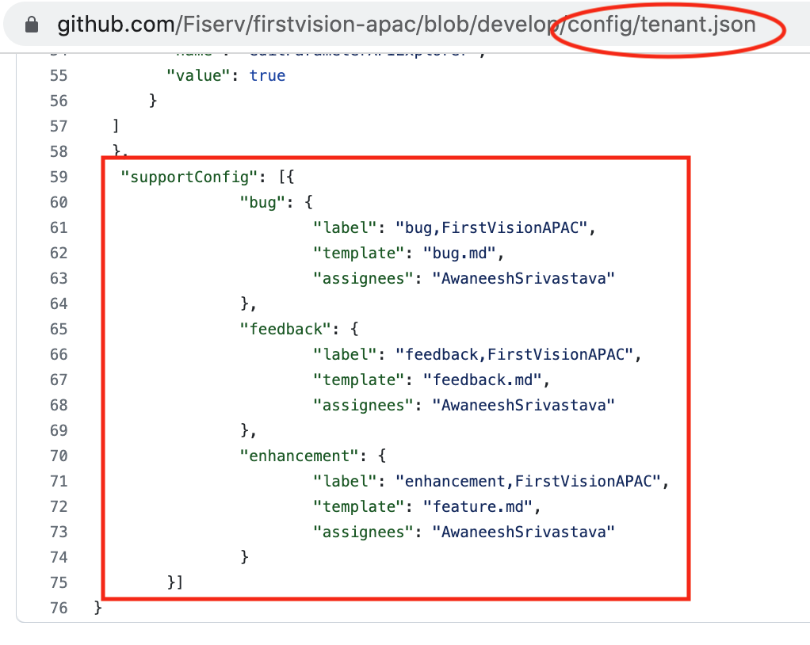

# Get Support

Developer Studio has [Support pages](https://developer.fiserv.com/support)

Every page has **Help** button in the right bottom corner. 

When expanded **Help Center** contains links to our [Git Support](https://github.com/Fiserv/Support).

To create an issue you need a github account.

  * Go to Support and click on **New Issue**
  
  
  
  * Select issue type: Bug report, Feature request, Feedback
  
  
  
  * Add label(s)
  
   
  
  * If the issue is with the specific product, add product label as well. Then the issue will be send to the assignee under support config in tenant.json
  
   
   
   # Setting Priority and Severity for any Issue
  

**Priority:**
Priority defines the order in which we should resolve a defect.  

DEFECT PRIORITY CLASSIFICATION.

**High:** Must be fixed in any of the upcoming builds but should be included in the release. 

**Medium:** May be fixed after the release / in the next release. 

**Low:** May or may not be fixed at all.

**Severity:** It is the extent to which the defect can affect the software. In other words, it defines the impact that a given defect has on the system.

DEFECT SEVERITY CLASSIFICATION 

**Critical:** The defect affects critical functionality or critical data. It does not have a workaround. Example: Unsuccessful installation, complete failure of a feature. 

**Major:** The defect affects major functionality or major data. It has a workaround but is not obvious and is difficult. Example: A feature is not functional from one module but the task is doable if 10 complicated indirect steps are followed in another module/s. 

**Minor:** The defect affects minor functionality or non-critical data. It has an easy workaround. Example: A minor feature that is not functional in one module but the same task is easily doable from another module. 

**Trivial:** The defect does not affect functionality or data. It does not even need a workaround. It does not impact productivity or efficiency. It is merely an inconvenience. Example: Petty layout discrepancies, spelling/grammatical errors. 

