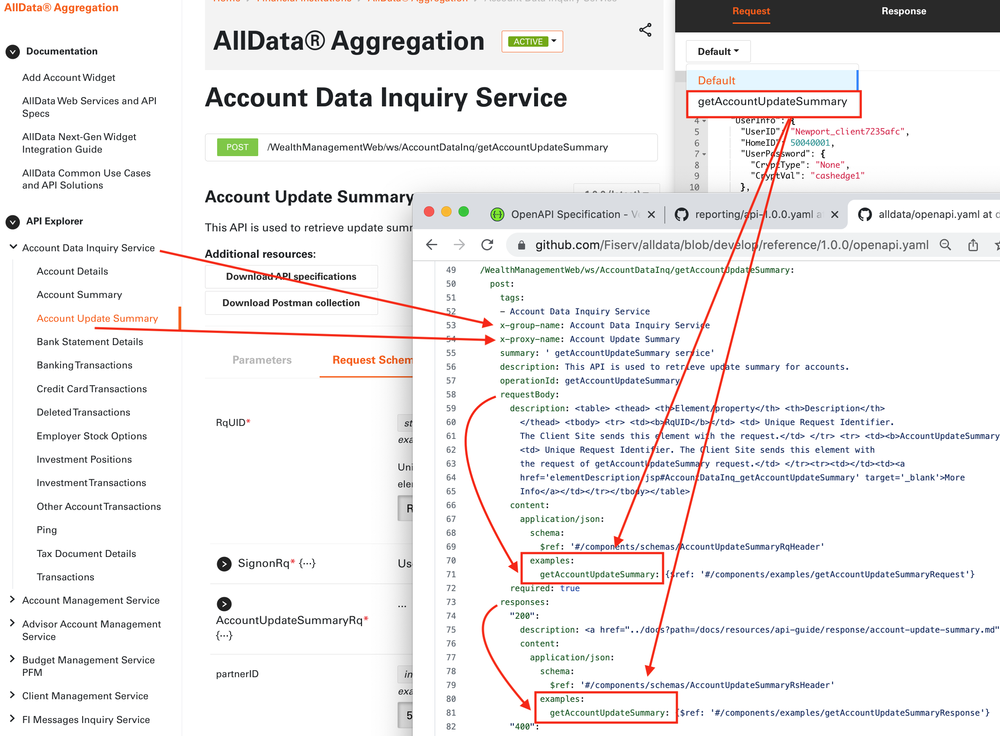

# Prism Mock Server

We offer two ways to test services defined by OpenAPI specification in Developer Studio. One way is to connect tenant openAPI spec to tenan sandbox. The other way to test an endpoint is to setup a mock server. We use [Stoplight Prism](https://meta.stoplight.io/docs/prism/ZG9jOjYx-overview) Mock server.

## Stoplight Prism Mock Server

There are couple of steps to follow for the prism mock server to work.
 
1. Add example request and responses in your openapi spec file so that prism mock server can validate your request payload and then return the correct mock response depending on that example. Below is such an instance. On the left hand side is a sample of how to add examples in your spec file and right hand side screenshot explains how it gets mapped on our UI.

    
 
 
2. To install and run Stoplight Prism locally refere to the following command 
  `npm install -g @stoplight/prism-cli`

3. We encorrage to test the openAPI spec locally before pushing the changes to GitHub.
  `prism mock <your yaml file name>`
 
4. Finally once you are done updating the spec files please let us know we would need to setup up an actual mock server and enable the Run Button.
