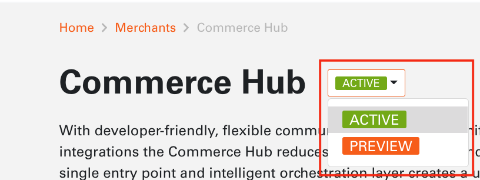
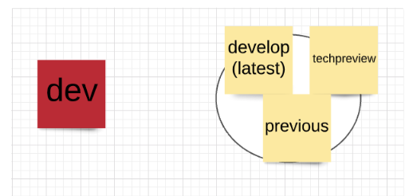

# Product Versions

Product and API Versioning has been enabled to view Preview, Active and Previous versions of the product.

### The purpose of creating branch versions is to:

 - support concept of technical preview.
 - simplify elastic search indexing mechanism (for develop and archive branches only).
 - create reliable mechanism to view old/archived versions of tenant files.

### Version git Branches

  ACTIVE - git develop branch
  PREVIEW - tech-preview branch to be merged into develop branch
  PREVIOUS - archived branch previously released from develop
  
  

