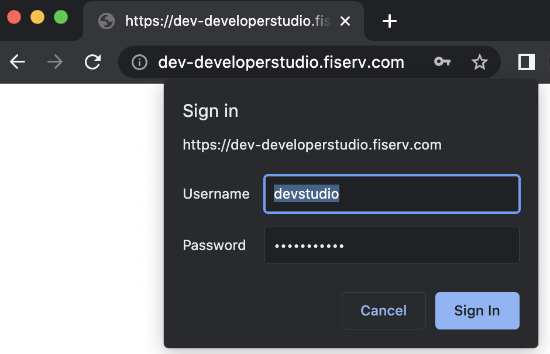
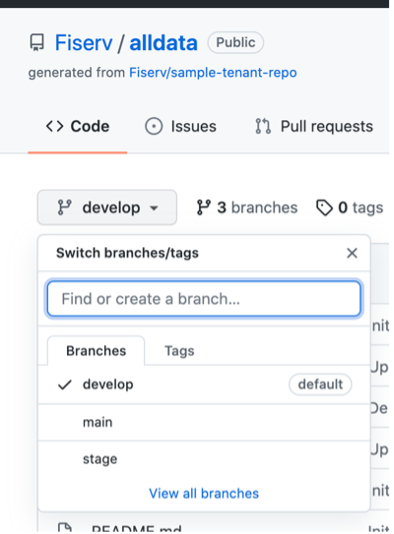

# Developer Studion environments

### Developer Studion has four environments

dev, qa, stage evironment require authentication credentials. Your tenant advocate will provide them.
Credentials are not be shared with your clients. Consult with your tenant advocate.

  - [dev](https://dev-developerstudio.fiserv.com)
  - [qa](https://qa-developerstudio.fiserv.com)
  - [stage](https://stage-developerstudio.fiserv.com)
  - [production](https://developer.fiserv.com)

### Git branches

There are **three git branches** that are required:

  - **develop** corresponds to [develop/qa environments](https://dev-developerstudio.fiserv.com)
  - **stage** corresponds to [stage environment](https://stage-developerstudio.fiserv.com)
  - **main** corresponds to [production environments](https://developer.fiserv.com)

### Developer Studio Release Schedule 

Developer Studio is on two week sprint schedule.
That means at the end of the sprint, every other Friday, dev code will be deployed to qa.
On the following Thursday (third week of the start of the sprint) qa code will be deployed to stage.
And finally on Thursday (fourth week of the start of the sprint) stage code is deployed to production.

> Tenant is responsible to sync up github repository in accordance with Developer Studio release schedule.
